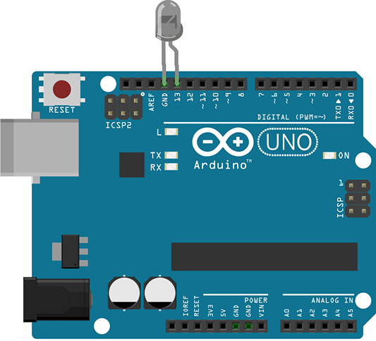
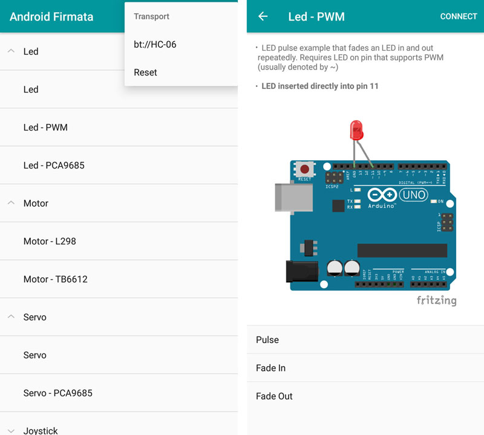

# Android-Firmata (IN DEVELOPING ...)

[](https://travis-ci.org/xujiaao/android-firmata)
[](http://jcenter.bintray.com/com/xujiaao/android/android-firmata/maven-metadata.xml)


**IoT Library for Android Developers. Inspired by [Johnny-Five].**

Android-Firmata is a client library of [Firmata] written in Kotlin.
It allows controlling Arduino (or other boards, such as [NodeMcu]...)
which runs Firmata Protocol from your Android application.


## Get Started

This piece of code shows how to "Blink an LED" with Android-Firmata:

````kotlin
class BlinkLedActivity : AppCompatActivity() {

    override fun onCreate(savedInstanceState: Bundle?) {
        super.onCreate(savedInstanceState)

        /**
         * Connect board through Bluetooth transport.
         *
         * NOTICE: Make sure the name of Bluetooth device is "HC-06",
         * and the device has already been bonded with your Android phone!!!
         */
        connectBoardWithLifecycle("bt://HC-06".toTransport(), lifecycle, {
            onConnecting { toast("Connecting...") }

            onConnected { board ->
                toast("Connected")

                val led = board.Led(13) // Create an Led on pin 13
                led.blink(500) // Blink every half second
            }

            onDisconnected { error ->
                if (error != null) {
                    toast("Disconnected: ${error.message}")
                }
            }
        })
    }
}
````




## Setup Bluetooth Device

Check out the [Johnny-Five Bluetooth Guide] to setup your Bluetooth Serial Port Module.


## Setup Arduino

- Download Arduino IDE

- Plug in your Arduino or Arduino compatible microcontroller via USB

- Open the Arduino IDE, select: File > Examples > Firmata > StandardFirmataPlus

  - StandardFirmataPlus is available in Firmata v2.5.0 or greater

- Click the "Upload" button

If the upload was successful, the board is now prepared and you can close the Arduino IDE.


## Setup NodeMcu (ESP8266)

If you have a NodeMcu board, and want to control it through WiFi, please check out the [NodeMcu Guide].


## Installation

In your build.gradle:

````
dependencies {
    implementation 'com.xujiaao.android:android-firmata:0.0.1'
}
````

## Sample Application (:link: [Link](https://github.com/xujiaao/android-firmata/releases/latest))

> **Note: All images in the sample application are copied from [Johnny-Five Examples Page].**



- To edit the Transport URI, open the Settings Menu, select: Transport

- To Connect/Disconnect the board, click the action button in the top right corner


## License

Android-Firmata is distributed under the terms of the MIT License. See the [LICENSE] file.


[Johnny-Five]: https://github.com/rwaldron/johnny-five
[Johnny-Five Bluetooth Guide]: https://github.com/rwaldron/johnny-five/wiki/Getting-Started-with-Johnny-Five-and-JY-MCU-Bluetooth-Serial-Port-Module
[Johnny-Five Examples Page]: http://johnny-five.io/examples
[Firmata]: https://github.com/firmata/protocol
[NodeMcu]: http://nodemcu.com
[NodeMcu Guide]: https://github.com/xujiaao/android-firmata/wiki/Getting-Started-with-Android-Firmata-and-NodeMcu-Board
[LICENSE]: LICENSE

