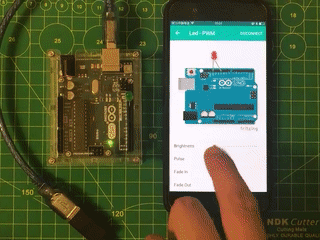

# Android-Firmata

[](https://travis-ci.org/xujiaao/android-firmata)
[](https://bintray.com/xujiaao/android/android-firmata/_latestVersion)

基于 [Firmata] 协议的 Android 物联网开发库 *(Android 版 [Johnny-Five] :trollface:)*, 使用 **Kotlin** 编写.

它允许您在 Android 应用中控制安装了 Firmata 协议的 **Arduino** 开发板.


## 依赖

在 build.gradle 中声明:

````
dependencies {
    implementation 'com.xujiaao.android:android-firmata:${android_firmata_version}'
}
````

[](https://bintray.com/xujiaao/android/android-firmata/_latestVersion)


## 快速上手

下面的展示如何通过 Android-Firmata 控制 LED 灯闪烁 (硬件版 "Hello World")

````kotlin
class GetStartedActivity : AppCompatActivity() {

    override fun onCreate(savedInstanceState: Bundle?) {
        super.onCreate(savedInstanceState)

        /**
         * Connect board through Bluetooth transport.
         *
         * NOTICE: Make sure the name of Bluetooth device is "HC-06",
         * and the device has already been bonded with your Android phone!!!
         */
        connectBoardWithLifecycle("bt://HC-06".toTransport(this), lifecycle, {
            onConnecting { toast("Connecting...") }

            onConnected { board ->
                toast("Connected")

                val led = board.Led(13) // Create an Led on pin 13
                led.blink(500) // Blink every half second
            }

            onDisconnected { error ->
                if (error != null) {
                    toast("Disconnected: ${error.message}")
                }
            }
        })
    }
}
````


## 使用方法

在使用 Android-Firmata 开发前, 您需要选择 Android 和 Arduino 设备间的连接方式:

- [通过蓝牙连接](#通过蓝牙连接)

- [通过 WiFi 连接](#通过-wifi-连接)

- [通过 USB 连接](#通过-usb-连接)


### 通过蓝牙连接

#### 准备

- StandardFirmataPlus v2.5.0 或更高版本

  - 打开 Arduino IDE > 示例 > Firmata > StandardFirmataPlus

- 蓝牙串口模块 (比如: HC-05, HC-06...):

  


#### 配置蓝牙模块

在连接到 Android-Firmata 之前, 您需要将蓝牙模块的波特率修改为 Firmata 默认的 `57600`.

关于如何配置蓝牙模块, 请参考: [Johnny-Five Bluetooth Guide]


#### 修改代码

为了让 Android 连接到指定设备, 您需要修改 Android 代码中的 [Transport URI](#transports):

可以使用下面两种 URI 进行蓝牙连接:

- `bt:<bluetooth_name>` *(使用蓝牙名称进行匹配)*

  - **使用蓝牙名称连接时, 请确保蓝牙设备已和您的手机配对**

- `bt:<bluetooth_mac_address>` *(使用 Mac 地址进行匹配)*

  - **请使用 `.` 或 `-` 替换 Mac 地址中的 `:` 分隔符 (比如: `bt://00.11.22.33.44.55`)**

示例:

````kotlin
/**
 * If the name of your Bluetooth device is "HC-06", then the URI should be:
 *
 *   "bt://HC-06"
 */
connectBoard("bt://HC-06".toTransport(context), ...)
````


### 通过 WiFi 连接

#### 准备

- StandardFirmata**WiFi** v2.5.0 或更高版本

  - 打开 Arduino IDE > 示例 > Firmata > StandardFirmata**WiFi**

- [NodeMcu] (ESP8266) 开发板

  


#### 配置 NodeMcu

关于如何在 NodeMcu 上安装 StandardFirmataWiFi, 请参考 [NodeMcu Guide].


#### 修改代码

使用 WiFi 连接时, [Transport URI](#transports) 如下:

- `tcp:<board_ip_address>:<board_port>`

示例:

````kotlin
/**
 * If the ip address is '192.168.4.1', and the port is '3030', then the URI should be:
 *
 *   "tcp://192.168.4.1"
 */
connectBoard("tcp://192.168.4.1".toTransport(context), ...)
````


### 通过 USB 连接

#### Requirements

#### 准备

- StandardFirmataPlus v2.5.0 或更高版本

  - 打开 Arduino IDE > 示例 > Firmata > StandardFirmataPlus

- 支持 OTG 的 Android 手机

- [OTG 连接线](https://www.adafruit.com/product/1099)

  


#### 修改代码

使用 USB 连接时, [Transport URI](#transports) 为: `usb`


## 文档

### Transports

Android-Firmata 使用 Transport URI 来指定 Android 和 Arduino 的通信方式:

- Bluetooth:

  - `bt:<bluetooth_name>` *(使用蓝牙名称进行匹配)*

    - **使用蓝牙名称连接时, 请确保蓝牙设备已和您的手机配对**

  - `bt:<bluetooth_mac_address>` *(使用 Mac 地址进行匹配)*

    - **请使用 `.` 或 `-` 替换 Mac 地址中的 `:` 分隔符 (比如: `bt://00.11.22.33.44.55`)**

- WiFi:

  - `tcp:<board_ip_address>:<board_port>`

- USB:

  - `usb`


## 示例应用 (:link: [下载链接](https://github.com/xujiaao/android-firmata/releases/latest))

示例应用中展示了如何通过 Android-Firmata 操控物理设备.


> 示例应用中的图片取自 [Johnny-Five Examples Page]


### 用法:

- [下载](https://github.com/xujiaao/android-firmata/releases/latest) 并安装示例应用

- 选择一个示例

- 按照示例图片进行接线

- 点击 "Connect/Disconnect" 按钮来连接/断开开发板

- 如果需要修改 [Transport URI](#transports), 请在首页中打开 "Settings" 菜单, 选择  "Transport"


[Johnny-Five]: https://github.com/rwaldron/johnny-five
[Johnny-Five Bluetooth Guide]: https://github.com/rwaldron/johnny-five/wiki/Getting-Started-with-Johnny-Five-and-JY-MCU-Bluetooth-Serial-Port-Module
[Johnny-Five Examples Page]: http://johnny-five.io/examples
[Firmata]: https://github.com/firmata/protocol
[NodeMcu]: http://nodemcu.com
[NodeMcu Guide]: https://github.com/xujiaao/android-firmata/wiki/Getting-Started-with-Android-Firmata-and-NodeMcu-Board